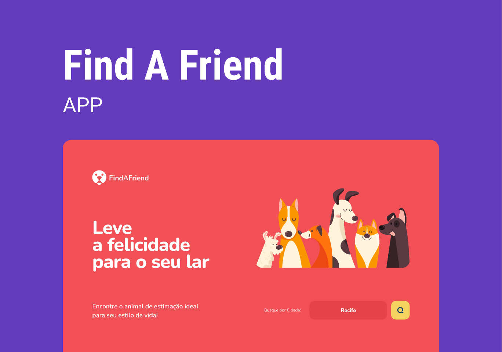

# Find A Friend API

## Sobre o Projeto
O Find A Friend API é uma aplicação desenvolvida para facilitar a adoção de pets. Através dessa API, organizações (ORGs) podem cadastrar animais disponíveis para adoção, e usuários podem buscar por pets de acordo com suas preferências e localização. A aplicação permite filtrar os pets por características específicas e visualizar detalhes completos de cada animal. Além disso, a plataforma possibilita que as ORGs gerenciem seus cadastros e interajam com os adotantes via WhatsApp, tornando o processo de adoção mais eficiente e acessível.

## Regras da Aplicação
- [ ] Deve ser possível cadastrar um pet.
- [ ] Deve ser possível listar todos os pets disponíveis para adoção em uma cidade.
- [ ] Deve ser possível filtrar pets por suas características.
- [ ] Deve ser possível visualizar detalhes de um pet para adoção.
- [x] Deve ser possível se cadastrar como uma ORG.
- [ ] Deve ser possível realizar login como uma ORG.

## Regras de Negócio
- [ ] Para listar os pets, obrigatoriamente precisamos informar a cidade.
- [ ] Uma ORG precisa ter um endereço e um número de WhatsApp.
- [ ] Um pet deve estar ligado a uma ORG.
- [ ] O usuário que quer adotar, entrará em contato com a ORG via WhatsApp.
- [ ] Todos os filtros, além da cidade, são opcionais.
- [ ] Para uma ORG acessar a aplicação como admin, ela precisa estar logada.